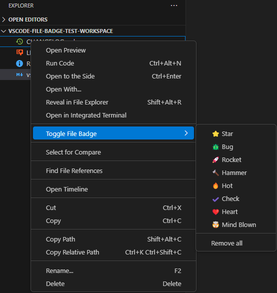
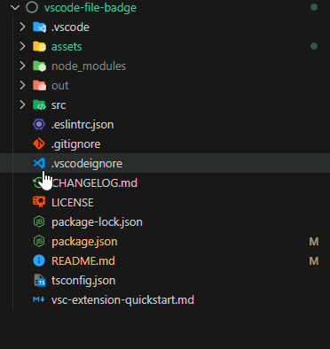

# file-badge README

File Badge allows you to toggle tagging multiple files with a custom badge and file text color.

## Features

v0.1.0             |  v0.0.1
:-------------------------:|:-------------------------:
  |  

## Extension Settings

This extension contributes the following settings:

-   ~~`fileBadge.badge`: String containing the badge to show on tagged files.~~ (Removed in v0.1.0)
-   `fileBadge.tooltip`: String containing the tooltip on tagged files.

Theme color:

-   `fileBadge.treeItemTextForeground`: Color of the filename text when tagged

## Changelog

The changelog can be found in the [CHANGELOG.md](./CHANGELOG.md) file.

**Enjoy!**
